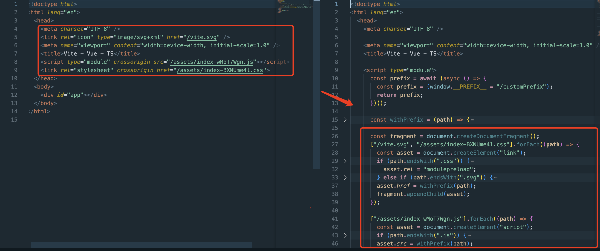

# vite-plugin-html-public-path
Implement dynamic `public path` in index.html

# Why need the plugin? 

Sometime, we need to set the `public path` dynamically, for example, when we use `vite` to build the project, we need to set the `public path` according to the environment. but, we can't set the `public path` in the `index.html` file, so we need to use this plugin to transform all static `link/script` tags to dynamic tags



## Install

```bash
pnpm install vite-plugin-html-public-path -D
```

## Usage

you can use `initialPrefixScript` to return the `public path` of the application.
```js
import { defineConfig } from 'vite'
import htmlPublicPath from 'vite-plugin-html-public-path'

// https://vitejs.dev/config/
export default defineConfig({
  plugins: [
    htmlPublicPath({
      // it will be injected to head of script tag
      initialPrefixScript: `
        const prefix = window.__PREFIX__ = "/customPrefix";
        return prefix;
      `
    })
  ],
})
```

with `async` case, you can use `await` in `initialPrefixScript`
```js
import { defineConfig } from 'vite'
import htmlPublicPath from 'vite-plugin-html-public-path'

// https://vitejs.dev/config/
export default defineConfig({
  plugins: [
    htmlPublicPath({
      initialPrefixScript: `
        const prefix = await new Promise((resolve) => {
          setTimeout(() => {
            resolve("/customPrefix");
          }, 1000);
        });
        return prefix;
      `
    })
  ],
})
```

## Options

### initialPrefixScript

- **type**: `string`
- **default**: ""

provide `runtime code` to get the `public path` of the application. It will be injected to head of `script` tag. support async and await.